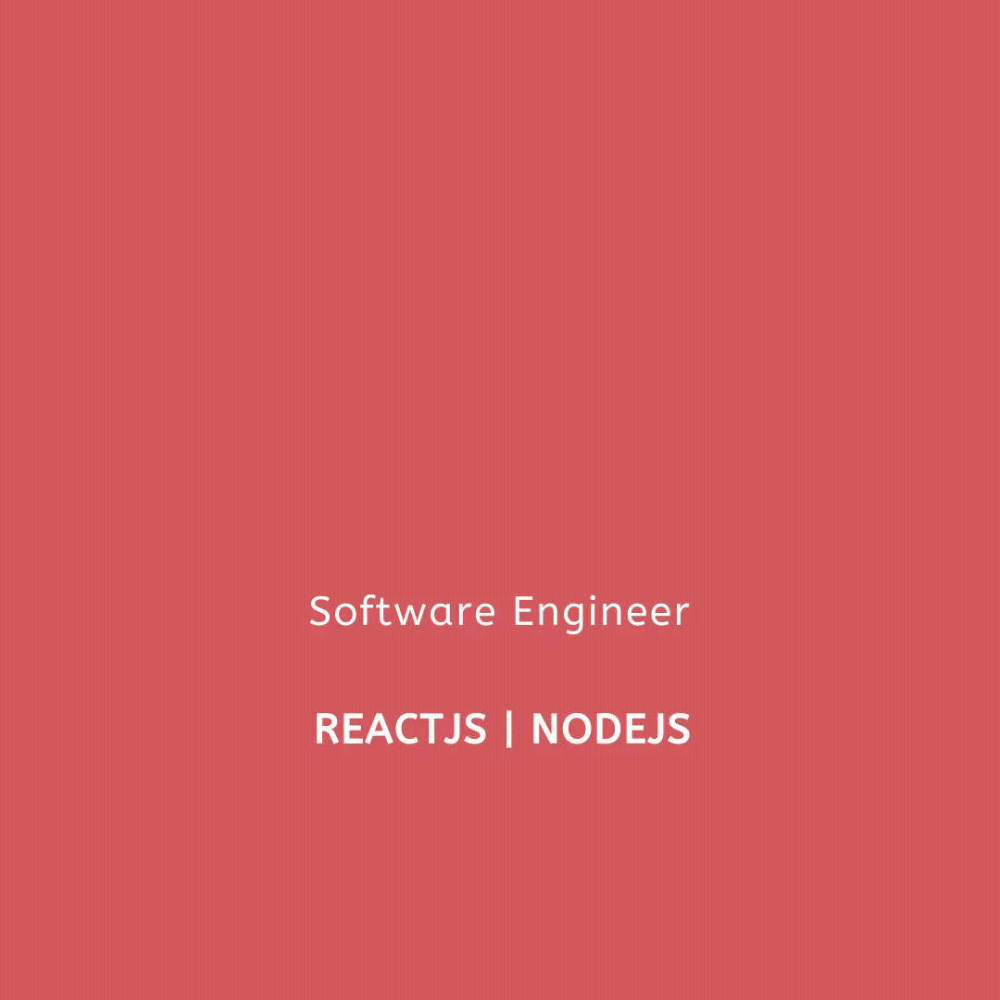

<!--
**Ileriayo/ileriayo** is a ✨ _special_ ✨ repository because its `README.md` (this file) appears on your GitHub profile.
--->  

<h1 align="center"> 👋 </h1>

  

 (Open for Hiring)

<h2 align="center"> 👨‍💻 About Me</h2>

  <samp>
    Hello, I'm Eddy, a Computer Science graduate deeply passionate about cloud computing, DevOps Engineering, infrastructure as code, and software engineering. Currently, I hold one AWS certification and am       
    actively pursuing two more (SAA & AWS Developer). My expertise lies in full-stack web development, with proficiency in JavaScript, Node.js, MongoDB, Express.js, and Postgres. I'm actively exploring 
    Infrastructure as Code (IAC) with Terraform on both AWS & Azure platforms, alongside Kubernetes, Docker, Linux, Git, and GitHub Actions.
  </samp>
     
  

<h2 align="center"> 🔭 Tools of Trade</h2>

  &nbsp;&nbsp;&nbsp;
  &nbsp;&nbsp;&nbsp;
  &nbsp;&nbsp;&nbsp;
  &nbsp;&nbsp;&nbsp;

<h2  align="center">📫 Reach me on</h2>

  &nbsp;&nbsp;&nbsp;&nbsp;
  &nbsp;&nbsp;&nbsp;&nbsp;
  &nbsp;&nbsp;&nbsp;&nbsp;

<h2  align="center">💻 Check Out My Repos ⬇️ </h2>
